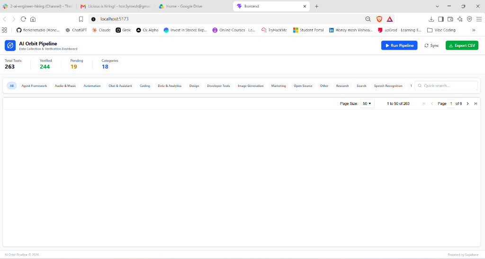
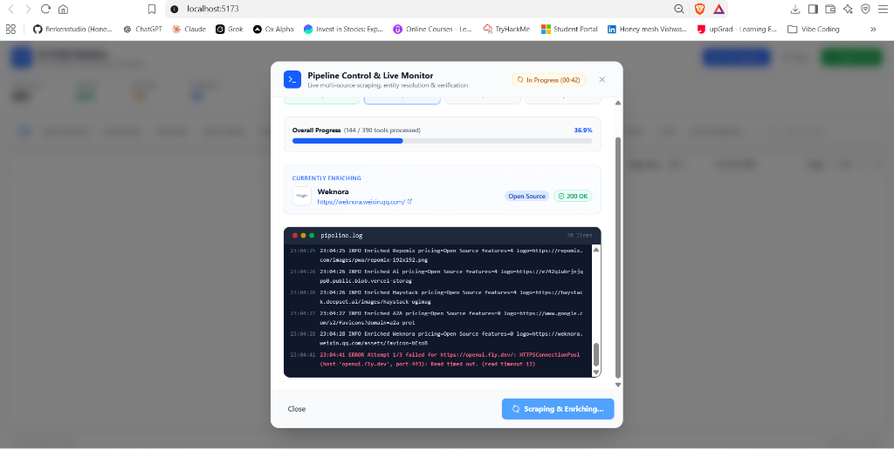
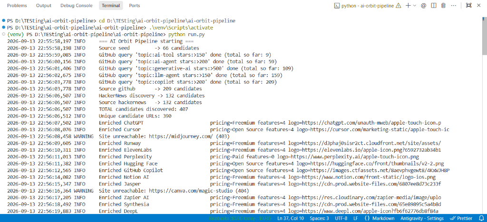

# AI Orbit Data Ingestion Pipeline & Web Dashboard

<p align="center">
  <strong>API-first, modular ingestion engine and real-time dashboard for discovering, scraping, classifying, and deduplicating AI tools across the web.</strong>
</p>

<p align="center">
  <a href="https://buymeacoffee.com/flerken"></a>
  
  
  
  
  
</p>

---

## Table of Contents
- [Architecture Overview](#architecture-overview)
- [Key Features](#key-features)
- [Entity Resolution & Deduplication](#entity-resolution--deduplication)
- [Live Interactive Web Dashboard](#live-interactive-web-dashboard)
- [Quick Start Guide](#quick-start-guide)
  - [1. Prerequisites & Environment](#1-prerequisites--environment)
  - [2. CLI Pipeline Run](#2-cli-pipeline-run)
  - [3. Full Web Application (Backend + Frontend)](#3-full-web-application-backend--frontend)
- [Pipeline Stages](#pipeline-stages)
- [Data Storage & Output Formats](#data-storage--output-formats)
- [Running Automated Tests](#running-automated-tests)
- [Support & Donations](#support--donations)
- [License](#license)

---

## Architecture Overview

The pipeline operates as a staged, decoupled ingestion pipeline with error isolation at every step:

```
┌─────────────┐     ┌──────────────┐     ┌──────────────┐     ┌──────────────┐
│  Discovery  │ ──> │  Extraction  │ ──> │   Cleaning   │ ──> │ Resolution & │
│ (Seed, GH,  │     │  (Pricing,   │     │ (HTML sanit, │     │ Deduplication│
│     HN)     │     │ Feats, Logos)│     │ URLs, text)  │     │(Domain+Fuzzy)│
└─────────────┘     └──────────────┘     └──────────────┘     └──────────────┘
                                                                      │
                                                                      ▼
┌─────────────┐     ┌──────────────┐     ┌──────────────┐     ┌──────────────┐
│   Export    │ <── │  Validation  │ <── │Relationship  │ <── │Classification│
│ (Supabase,  │     │ Quality Gate │     │   Graph      │     │  (Taxonomy   │
│  CSV, JSON) │     │ (Pass / Fail)│     │  Builder     │     │  Categories) │
└─────────────┘     └──────────────┘     └──────────────┘     └──────────────┘
```

Each stage lives in its own package under `src/`, allowing any component to be extended or swapped without affecting the others.

---

## Key Features

- **Multi-Source Discovery**: Integrates curated seeds, GitHub Search API (topics, stars, activity), and Hacker News Algolia API with noise filtering (excludes opinion articles, lay-off news, and controversies).
- **Deep Feature & Pricing Extraction**:
  - **Pricing Model**: Classifies tools as `Freemium`, `Open Source`, `Free`, or `Paid` via heuristic DOM and copy analysis.
  - **Key Features**: Extracts core value propositions, pitch statements, and capabilities from `<h1>`, `<h2>`, and structured lists.
  - **Social Links**: Captures official GitHub repos, Discord communities, Twitter/X profiles, and documentation links.
  - **Resilient Logos**: Priority search (`apple-touch-icon`, `og:image`, SVG) with high-res Google Favicon service fallback.
- **Anti-Bot Resilient Crawler**: Uses modern browser request headers and polite exponential backoff to handle bot-protected domains (Cloudflare, etc.).
- **Deterministic IDs**: Generates stable UUIDv5 IDs derived from `entity_type + canonical URL`, keeping IDs persistent across re-runs.
- **Quality Gate Validation**: Enforces mandatory name, description length, HTTPS validation, logo presence, and category assignment (100% pass rate).

---

## Entity Resolution & Deduplication

1. **Domain-First Identity**: The canonical registrable domain (e.g. `openai.com`) serves as primary identity for deduplication.
2. **Fuzzy Name Matching**: RapidFuzz (token-sort ratio $\ge 92$) catches near-duplicates across different subdomains or naming aliases and merges metadata.
3. **Cross-Domain Safety**: Flags potential conflicts into a review queue to prevent improper merges.

---

## Live Interactive Web Dashboard

The web dashboard provides a complete control center and spreadsheet view for the dataset:

- **Google-Sheets-Style Interface**: Powered by AG Grid Community with column filtering, sorting, multiple selections, and instant CSV export.
- **Centered Modal Pipeline Runner**: Click **"Run Pipeline"** in the top navigation to open a clean modal dialog.
- **Real-Time SSE Streaming**: Live progress bar, stage indicator, and real-time counter (`144 / 390 tools processed`).
- **Currently Enriching Card**: Live preview showing the tool currently being scraped with its logo, detected pricing, and HTTP status.
- **Live Terminal Window**: Embedded console streaming formatted `pipeline.log` output with color-coded levels (`INFO`, `WARNING`, `ERROR`, `SUCCESS`).
- **Stop / Cancel Control**: Red **"Stop Pipeline"** button cleanly halts crawling at any time without corrupting database state.
- **Auto-Sync**: Automatically refreshes the table grid upon pipeline completion.

<p align="center">
  
</p>

<p align="center">
  
</p>

---

## Quick Start Guide

### 1. Prerequisites & Environment

- **Python 3.10+**
- **Node.js 18+** & **npm**

Clone the repository and set up environment variables:

```bash
git clone https://github.com/flerkenstudio/ai-orbit-pipeline.git
cd ai-orbit-pipeline

# Copy environment template
cp .env.example .env
```

Edit `.env` with your credentials (optional but recommended):
```env
# Optional: raises GitHub API rate limits from 60 to 5,000 req/hr
GITHUB_TOKEN=ghp_your_github_token_here

# Supabase (optional: for remote database synchronization)
SUPABASE_URL=https://your-project.supabase.co
SUPABASE_ANON_KEY=your-anon-key-here
```

---

### 2. CLI Pipeline Run

To execute the data ingestion pipeline directly in your terminal:

```bash
# Set up Python virtual environment
python -m venv venv
source venv/bin/activate       # On Windows: venv\Scripts\activate

# Install dependencies
pip install -r requirements.txt

# Run ingestion pipeline
python run.py
```

<p align="center">
  
</p>

---

### 3. Full Web Application (Backend + Frontend)

To launch the full interactive web application:

#### Terminal 1 — Start FastAPI Server (Port 8000)
```bash
# Activate virtual environment
source venv/bin/activate       # On Windows: venv\Scripts\activate

# Run FastAPI streaming server
python server.py
```

#### Terminal 2 — Start Frontend Dashboard (Port 5173)
```bash
cd frontend
npm install
npm run dev
```

Open **`http://localhost:5173`** in your browser to view the dashboard and run the pipeline interactively.

---

## Pipeline Stages

| Stage | Package / File | Purpose |
|---|---|---|
| **1. Discovery** | `src/discovery/` | Multi-source candidate discovery (Seed, GitHub API, Hacker News API). |
| **2. Extraction** | `src/extraction/` | Official site crawling, pricing detection, feature extraction, logo resolution. |
| **3. Cleaning** | `src/cleaning/` | URL canonicalization, HTML stripping, description clamping, entity sanitization. |
| **4. Normalization** | `src/normalization/` | Name cleaning, company suffix stripping, alias collection. |
| **5. Deduplication**| `src/deduplication/`| Domain-first and RapidFuzz fuzzy token-sort entity merging. |
| **6. Classification**|`src/classification/`| Keyword-based rule engine mapping tools to taxonomy categories. |
| **7. Relationships**| `src/relationships/`| Edge generation for `Tool -> solves -> Task` knowledge graphs. |
| **8. Validation** | `src/validation/` | Quality gate verifying schemas, lengths, logos, and links. |
| **9. Export** | `src/export/` | File generation (`CSV`, `JSON`) and Supabase synchronization. |

---

## Data Storage & Output Formats

| File | Description |
|---|---|
| [`data/export/tools_sheet.csv`](data/export/tools_sheet.csv) | Flat CSV with Pricing, Features, Websites, Logos, and GitHub repos. |
| [`data/entities.json`](data/entities.json) | Structured array of deduplicated tool entity objects. |
| [`data/relationships.json`](data/relationships.json) | Relationship graph edges linking tools to tasks/capabilities. |
| [`data/validation_report.json`](data/validation_report.json) | Quality gate breakdown with pass/fail counts and validation issues. |

---

## Running Automated Tests

Run the test suite with pytest:

```bash
pytest tests/ -v
```

All 12 automated unit tests cover:
- URL normalization & scheme fallback
- Canonical domain extraction
- Entity name canonicalization
- Deterministic UUIDv5 stability
- Text cleaner & description length clamping
- Freemium & Open-Source pricing extractors
- Social link parsing (GitHub, Discord, Twitter, Docs)
- Resilient logo fallbacks

---

## Support & Donations

If you find this project helpful, please consider supporting its development:

<p align="left">
  <a href="https://buymeacoffee.com/flerken">
    
  </a>
</p>

- **Buy Me a Coffee**: [buymeacoffee.com/flerken](https://buymeacoffee.com/flerken)

---

## License

MIT License — free for educational and commercial use.
